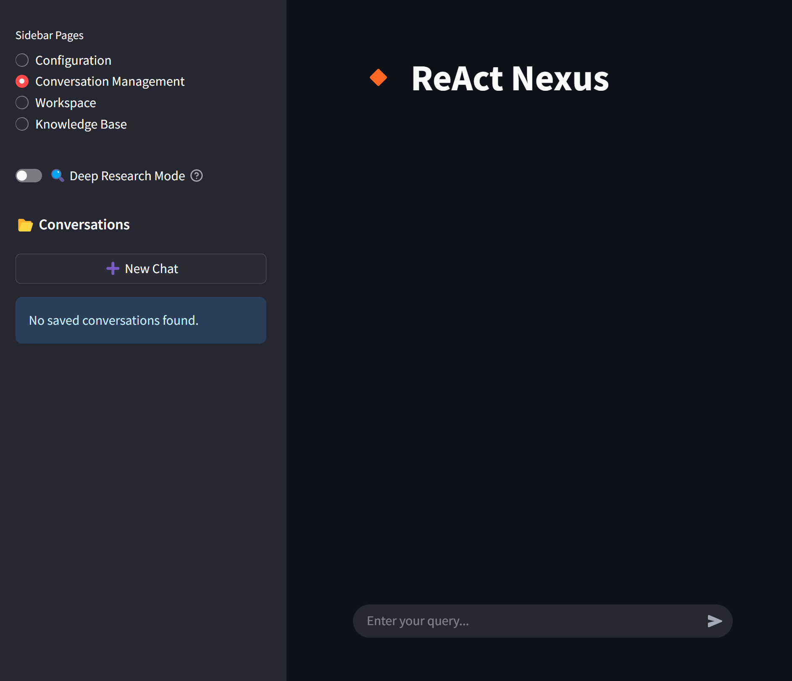

# ReAct-Nexus: Advanced Conversational AI Workspace

A **modular Streamlit-based platform** integrating multiple AI models, real-time search, web scraping, stock data retrieval, conversation management, and Python code execution capabilities with advanced planning and execution features. ReAct-Nexus provides a comprehensive environment for building and interacting with AI-powered conversational agents.



---

## Features

- **Conversational AI**: Chat with various LLMs through compatible API endpoints
- **Automated Title Generation** for conversations using LLMs
- **Web Search**: Real-time queries via Tavily API
- **Web Scraping**: Extract content from URLs with BeautifulSoup and advanced scraping via Firecrawl
- **Stock Data Retrieval**: Fetch real-time stock info via Alpha Vantage API
- **Python Code Execution**: Run code snippets dynamically (demo purposes only; unsafe for production)
- **Conversation Management**:
  - Save/load conversations with metadata (title, timestamp)
  - Automatic conversation saving and indexing
  - Schema migration for legacy files
  - Delete specific messages in conversations
- **File Operations**: Read, write, delete, list files within a workspace directory
- **Workspace Explorer**: Browse and open files with system applications directly from the UI
- **Knowledge Base Sidebar**: Direct access to knowledge base management without navigating through configuration
- **Memory Management**: Store and manage conversation context and variables
- **Specialized Component Framework (SCF)**:
  - Break down complex problems into specialized sub-problems
  - Route queries to specialized components (Researcher, Analyst, Planner, Executor, Synthesizer)
  - Component-specific system prompts and tool filtering
  - Configurable via JSON file
- **Dynamic Plan Adjustment**:
  - Recover from failures with RETRY, REPLACE, SKIP, or ABORT actions
  - Add additional steps during execution based on new information
  - Automatic dependency management when modifying plans
- **Cross-Query Memory**:
  - Maintain context across multiple queries within the same conversation
  - Toggle inclusion/exclusion of previous responses in memory
- **Deep Research Mode**:
  - Toggle for more thorough research with detailed results
  - Accessible from the sidebar above the Conversations section

---

## Installation

1. **Clone the repository**

```bash
git clone https://github.com/kongpop10/ReAct-Nexus.git
cd ReAct-Nexus
```

2. **Install dependencies**

```bash
pip install -r requirements.txt
```

### Dependencies

- streamlit
- openai
- requests
- python-dotenv
- tavily-python
- firecrawl-py

---

## Configuration

Create a `.env` file in the root directory and add your API keys:

```
# OpenRouter API Key
LLM_API_KEY=your_openrouter_api_key
# Optional: LLM_API_BASE_URL=your_llm_api_base_url

# Provider-specific API Keys
OPENAI_API_KEY=your_openai_api_key
XAI_API_KEY=your_xai_api_key

# Other service API keys
TAVILY_API_KEY=your_tavily_key
ALPHA_VANTAGE_API_KEY=your_alpha_vantage_key
FIRECRAWL_API_KEY=your_firecrawl_key
```

These are required for AI completions, web search, stock data, and advanced web scraping/crawling respectively.

The default API base URL is set to OpenRouter (`https://openrouter.ai/api/v1`), but you can configure it to use any compatible API endpoint. For OpenAI, the base URL is fixed at `https://api.openai.com/v1`, and for xAI (Grok), it's fixed at `https://api.x.ai/v1`.

### Model Configuration

The application uses different models for different tasks:

- **Planner Model**: Used for generating execution plans
- **Executor Model**: Used for executing plan steps
- **Summarizer Model**: Used for generating final responses
- **Title Model**: Used for generating conversation titles

Each provider has its own set of default models:

#### OpenRouter (Default)
- **Planner Model**: `google/gemini-2.5-pro-exp-03-25:free`
- **Executor Model**: `google/gemini-2.0-flash-thinking-exp-1219:free`
- **Summarizer Model**: `deepseek/deepseek-chat-v3-0324:free`
- **Title Model**: `google/gemini-2.0-flash-exp:free`

#### OpenAI
- **Planner Model**: `o4-mini`
- **Executor Model**: `o4-mini`
- **Summarizer Model**: `gpt-4.1`
- **Title Model**: `gpt-4.1-nano`

#### xAI (Grok)
- **Planner Model**: `grok-3-mini-beta`
- **Executor Model**: `grok-3-mini-beta`
- **Summarizer Model**: `grok-3-mini-beta`
- **Title Model**: `grok-3-mini-beta`

Note: The Summarizer Model is different from the Synthesizer component in the Specialized Component Framework. The Summarizer Model is used for generating the final response to the user, while the Synthesizer component is a specialized agent that uses the Planner and Executor models with a specific system prompt focused on combining information from multiple sources.

These can be configured in the UI or by editing the `model_config.json` file. When an API base URL is provided, the application will attempt to fetch available models for OpenAI and Grok compatible providers.

### SCF Configuration

Specialized Component Framework can be configured by editing the `scf_config.json` file. This file defines the specialized components and their routing rules.

The SCF includes several specialized components:

- **Researcher**: Specialized in gathering information from multiple sources
- **Analyst**: Specialized in analyzing and evaluating information
- **Planner**: Specialized in organizing and structuring tasks
- **Executor**: Specialized in implementing and running operations
- **Synthesizer**: Specialized in combining information from multiple sources into coherent outputs

Each component uses the same LLM models configured in `model_config.json` but with different system prompts and tool capabilities optimized for their specific functions.

The SCF automatically routes queries to the appropriate component based on the query complexity and content. For medium to high complexity queries, the system will select the most appropriate specialized component to handle the request.

---

## Usage

### Running the Application

You can run the application in two ways:

1. **Using the batch file (Windows)**:
   - Simply double-click the `run_react.bat` file
   - Or run it from the Windows Start Menu if you've created a shortcut

2. **Using Streamlit directly**:

```bash
# Run the application from the command line
streamlit run main.py
```

Navigate to the local URL provided by Streamlit to access the interface.

### Deep Research Mode

The application includes a "Deep Research Mode" toggle in the sidebar above the Conversations section. When enabled, the AI will perform more thorough research with more detailed results. This is useful for complex queries that require in-depth analysis.

### Workspace Explorer

The Workspace sidebar page allows you to browse and interact with files in the workspace directory:

1. Select "Workspace" from the sidebar navigation options
2. Browse through directories by clicking on them
3. Navigate back using the breadcrumb navigation
4. Click on any file to open it with the default system application for that file type

This feature provides a convenient way to manage and access files created or used by the AI assistant.

### Knowledge Base Sidebar

The Knowledge Base sidebar page provides direct access to manage your knowledge sources:

1. Select "Knowledge Base" from the sidebar navigation options
2. View existing web sources and local files in your knowledge base
3. Add new web sources by providing URLs
4. Upload local markdown files to add to your knowledge base
5. Delete knowledge sources that are no longer needed

This dedicated sidebar page makes it more convenient to access and manage your knowledge base without having to navigate through the configuration page.

### Knowledge Base Integration

The application automatically integrates knowledge base content into its responses:

1. When content is added to the knowledge base, it's stored both in the file system and in memory with a unique key
2. During planning, the system includes information about available knowledge base entries
3. The executor can search the knowledge base using `kb_search` and retrieve specific content using `kb_get`
4. Retrieved knowledge is incorporated into the final response
5. Different SCF components have different capabilities for interacting with the knowledge base

---

## Project Structure

The application has been refactored for improved modularity and maintainability:

```
/ReAct-Nexus
│
├── config.py                # Configuration settings and constants
├── app_config.py            # Application configuration and shared instances
│
├── main.py                  # Main entry point
│
├── tools/                   # Tool implementations
│   ├── __init__.py          # Tool registry
│   ├── web_tools.py         # Web search and scraping tools
│   ├── file_tools.py        # File operations
│   ├── enhanced_file_tools.py # Enhanced file listing
│   ├── system_tools.py      # System interaction tools
│   ├── memory_tools.py      # Memory management
│   ├── knowledge_tools.py   # Knowledge base operations
│   ├── execution_tools.py   # Python execution
│   ├── stock_tools.py       # Stock data retrieval
│   ├── firecrawl_tools.py   # Advanced web scraping
│   ├── text_tools.py        # Text processing utilities
│
├── llm/                     # LLM interaction
│   ├── __init__.py
│   ├── client.py            # Client initialization
│   ├── planner.py           # Planning functions
│   ├── executor.py          # Execution functions
│   ├── summarizer.py        # Response generation
│   ├── plan_adjuster.py     # Dynamic plan adjustment
│
├── scf/                     # Specialized Component Framework
│   ├── __init__.py
│   ├── scf_manager.py       # SCF coordination
│   ├── manager_instance.py  # SCF instance initialization
├── scf_config.json          # Component definitions
│
├── ui/                      # UI components
│   ├── __init__.py
│   ├── chat.py              # Chat interface
│   ├── sidebar.py           # Sidebar components
│   ├── workspace_sidebar.py # Workspace file explorer
│   ├── knowledge_base_sidebar.py # Knowledge base management
│
├── utils/                   # Utility functions
│   ├── __init__.py
│   ├── conversation.py      # Conversation management
│   ├── formatting.py        # Text formatting
│   ├── status.py            # Status indicators
│   ├── file_system.py       # File system utilities
│
├── storage/                 # Storage management
│   ├── __init__.py
│   ├── knowledge_manager.py # Knowledge base management
│   ├── file_utils.py        # File operations
│
├── data_acquisition/        # External data collection
│   ├── __init__.py
│   ├── news_scraper.py      # Web scraping
│   ├── process_search_results.py # Search result processing
│
├── processing/              # Data processing
│   ├── __init__.py
│   ├── format_results.py    # Result formatting
│
├── agent_workspace/         # Workspace directory for file operations
│
├── model_config.json        # LLM model configuration
├── requirements.txt
├── README.md
├── .gitignore
```

### Summary of key folders and files:

- **`config.py`**: Centralized configuration settings
- **`app_config.py`**: Application configuration and shared instances
- **`main.py`**: Main entry point for the application
- **`model_config.json`**: LLM model configuration
- **`scf_config.json`**: Specialized Component Framework configuration
- **`tools/`**: All tool implementations with a central registry
- **`llm/`**: LLM interaction, planning, execution, and response generation
- **`scf/`**: Specialized Component Framework for complex queries
- **`ui/`**: User interface components
- **`utils/`**: Utility functions
- **`storage/`**: Persistent storage and knowledge management
- **`data_acquisition/`**: External data collection
- **`processing/`**: Data post-processing
- **`agent_workspace/`**: Workspace directory for file operations

---

## Additional Notes

- The application has been refactored for improved modularity, clarity, and scalability.
- The Specialized Component Framework (SCF) system allows handling complex queries more effectively.
- Dynamic Plan Adjustment enables recovery from failures and adaptation to new information.
- Cross-Query Memory maintains context across multiple queries within the same conversation.
- Deep Research Mode provides more thorough research capabilities for complex queries.
- The app **allows arbitrary Python code execution**, which is **unsafe for production**—use only in a secure, sandboxed environment.
- The UI has been optimized for a more streamlined user experience with compact conversation management and configurable components.
- The application supports Windows, macOS, and Linux platforms, with Windows-specific shortcuts provided for convenience.
- The Workspace Explorer feature provides cross-platform file opening capabilities, using the appropriate method for each operating system.
- The LLM configuration supports multiple providers (OpenRouter, OpenAI, xAI) with provider-specific model selections.
- The application supports the `reasoning_effort` parameter for OpenAI and xAI models that support it (like o3-mini, o4-mini, and grok-3-mini-beta).

---

## License

MIT License

---

## Credits

- Built with [Streamlit](https://streamlit.io/)
- AI powered by [OpenAI](https://openai.com/), [Google Gemini](https://ai.google.dev/), [xAI Grok](https://x.ai/), [DeepSeek](https://deepseek.ai/), and other LLMs (via [OpenRouter](https://openrouter.ai/))
- Web search via [Tavily](https://www.tavily.com/)
- Advanced web scraping via [Firecrawl](https://firecrawl.dev/)
- Stock data via [Alpha Vantage](https://www.alphavantage.co/)
- Specialized Component Framework inspired by specialized agent frameworks
- Dynamic Plan Adjustment inspired by adaptive planning systems

## Contributing

Contributions are welcome! Please feel free to submit a Pull Request.