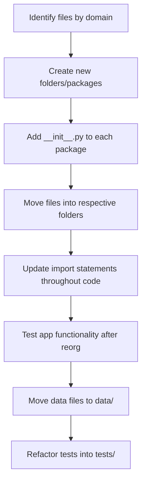

# 🗂️ Codebase Reorganization Plan

## Overview
Reorganize the current project into clearly defined domain-driven packages to improve maintainability, clarity, and scalability.

---

## High-level Structure
```
/ReAct
│
├── ai_module/            # AI logic, planning, execution
│   ├── __init__.py
│   ├── ai_client.py
│
├── data_acquisition/     # Web scraping, news, APIs
│   ├── __init__.py
│   ├── news_scraper.py
│   ├── process_news.py
│   ├── process_search_results.py
│   ├── web_tools.py
│   ├── stock_data.py
│
├── processing/           # Text & LaTeX processing, formatting
│   ├── __init__.py
│   ├── latex_processor.py
│   ├── format_results.py
│   ├── text_processor.py
│
├── storage/              # File/memory management, conversations
│   ├── __init__.py
│   ├── file_utils.py
│   ├── memory_manager.py
│   ├── conversation_manager.py
│
├── app.py                # Streamlit app entrypoint
├── requirements.txt
├── README.md
├── .gitignore
│
├── tests/                # All tests
│   ├── __init__.py
│   ├── test_latex_processing.py
│
├── data/                 # Data files, conversation logs, scraped content
│   ├── conversations_index.json
│   ├── conversation_*.json
│   ├── *.txt
│
└── agent_workspace/      # (Can be removed or repurposed)
```

---

## Folder Details

### `ai_module/`
- **Purpose:** All AI interaction, planning, execution logic
- **Files:** `ai_client.py`

### `data_acquisition/`
- **Purpose:** External data collection via scraping, APIs
- **Files:** `news_scraper.py`, `process_news.py`, `process_search_results.py`, `web_tools.py`, `stock_data.py`

### `processing/`
- **Purpose:** Data post-processing, LaTeX, formatting
- **Files:** `latex_processor.py`, `format_results.py`, `text_processor.py`

### `storage/`
- **Purpose:** Persistent storage, file/memory/conversation management
- **Files:** `file_utils.py`, `memory_manager.py`, `conversation_manager.py`

### `tests/`
- **Purpose:** All test scripts
- **Files:** `test_latex_processing.py`

### `data/`
- **Purpose:** Data files, logs, scraped content
- **Files:** JSON conversation logs, scraped `.txt` files, indexes

---

## Implementation Steps



1. **Create folders:** `ai_module/`, `data_acquisition/`, `processing/`, `storage/`, `tests/`, `data/`
2. **Add `__init__.py`** files to make them packages.
3. **Move files** into corresponding packages as per details above.
4. **Update imports** throughout the project:
   - e.g., `from ai_client import ...` → `from ai_module.ai_client import ...`
   - e.g., `from web_tools import ...` → `from data_acquisition.web_tools import ...`
5. **Move data files** (`*.json`, `*.txt`) into `data/`
6. **Test** the app thoroughly after restructuring.
7. **Update `.gitignore`** if needed.
8. **Document** the new structure in `README.md`.

---

## Additional Notes
- Clean up nested `agent_workspace/agent_workspace/` after migration.
- Consider adding more tests in the future.
- For configs/secrets, consider a dedicated `config/` folder or `.env` file.
- Watch out for circular imports during refactoring.

---

## Summary
This plan groups related components by domain, improving clarity and scalability. Follow the implementation steps carefully, testing as you go, to ensure a smooth migration.